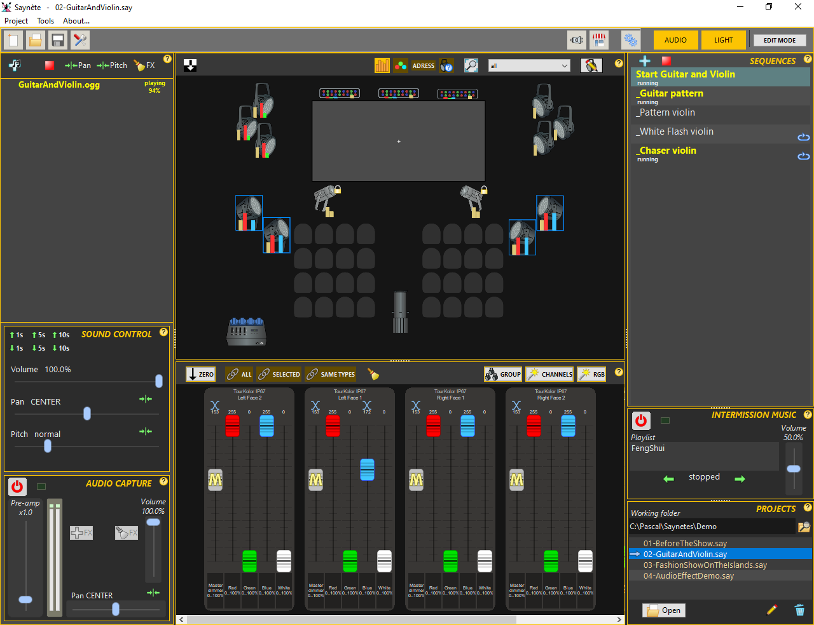
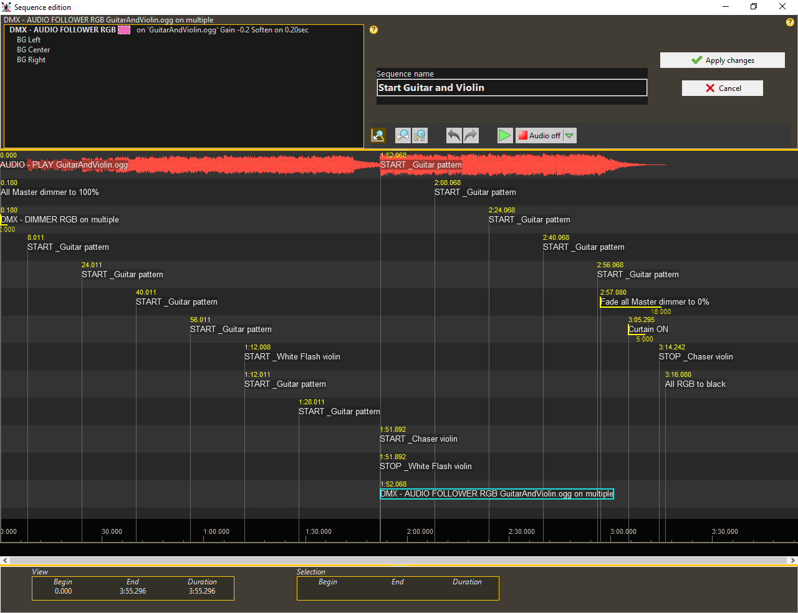

# Saynètes

Sound and lighting control software. Free and open source, written in FreePascal with Lazarus IDE.  
License: GPLv3  
Author: Lulu  

## Supported platforms
Windows 64b (tested on Win10)  
Windows 32b, 7 and + (tested on Win7 32b)  
Linux 64b - GTK2 - with oversized font height and some wrong colors (tested on Ubuntu 22.04 LTS)  

## Supported DMX Device
Velleman K8062  
Enttec USB DMX PRO  

## Download
Last release can be found [here](https://github.com/Lulu04/Saynetes/releases/latest)  
**Portable version**: no installation, simply unzip the downloaded package.  
**Installable version**: (only Windows) download and run the setup package.  

## Contributions
You can contribute by adding new fixture definitions to Saynètes. If you do, please, send a copy of the definition [here](https://github.com/Lulu04/Saynetes/issues) or by mail at lulutech@gmx.fr, they will be added in the next release. 
If you found bugs or have ideas for improving Saynètes, please submit them in the [issue channel](https://github.com/Lulu04/Saynetes/issues) in this repository and be patient. thanks !  

## Screenshots
The main window

  
Create sequences and build your show

# How to compile
You must have Lazarus IDE installed on your system with BGRABitmap and Synapse packages.  
- create a directory named saynetes on your disk
- in 'saynetes' directory clone this repository. You can also download the zip.
- again in 'saynetes' directory, clone the repository [UnitsCommon](https://github.com/Lulu04/UnitsCommon). If you choose to download the zip, unzip the file and rename the obtained directory to "UnitsCommon".
- always in the 'saynetes' directory, clone the repository [ALSound library](https://github.com/Lulu04/ALSound). If you choose to download the zip, unzip the file and rename the obtained directory to "ALSound".

The directory structure should be like:  
`|- saynetes`  
`    |- ALSound`  
`    |- Saynetes (if you clone the repository) or Saynetes-main (if you download ZIP)`  
`    |- UnitsCommon`  
  
Now, you are able to open the Lazarus project in the directory Saynetes or Saynetes-main.  

# History
The SAYNÈTES story began around 2011. It was born out of the technical needs felt when setting up amateur live shows.
At first, the software only managed audio, then the possibility of renting DMX lighting equipment at low cost presented itself, and it evolved to support this protocol, at first in a rudimentary way. Needs guided its evolution.
This version of Saynètes has been completely rewritten by the author, who is passionate about programming.
